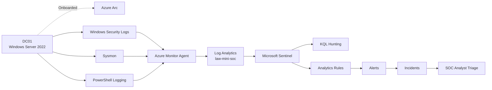
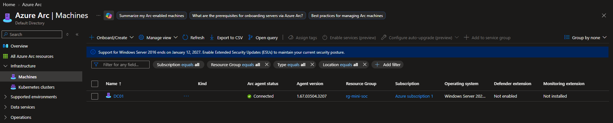
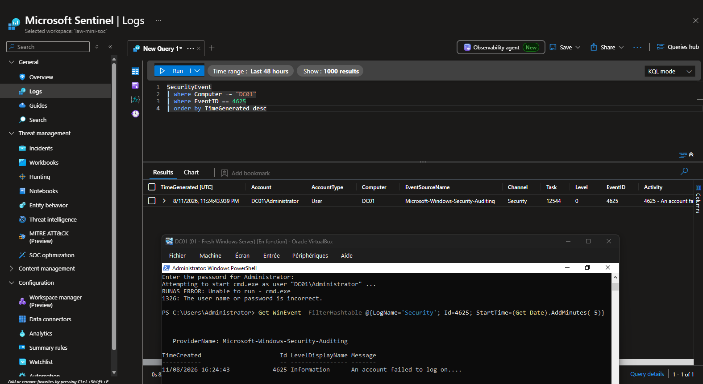
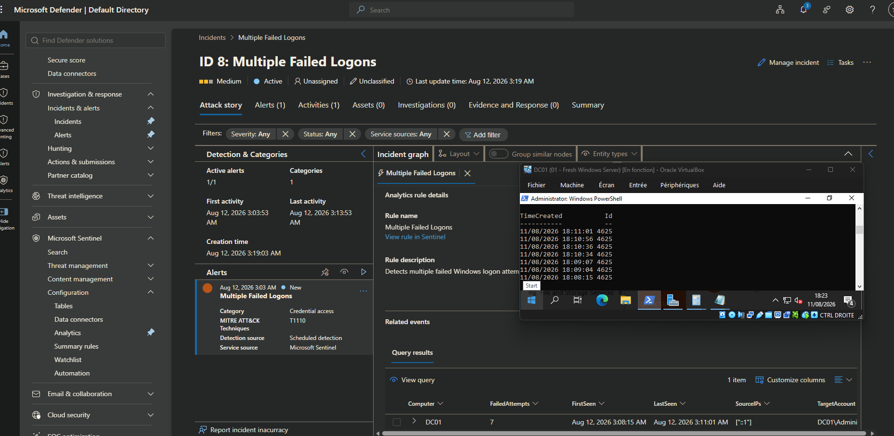
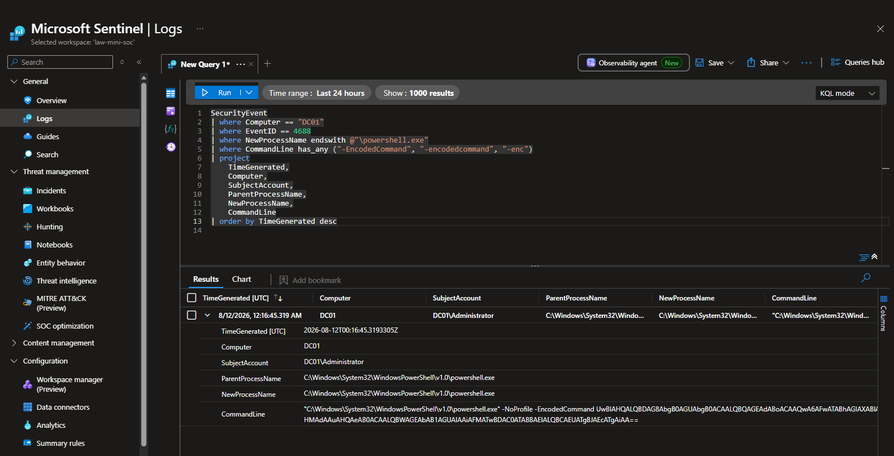
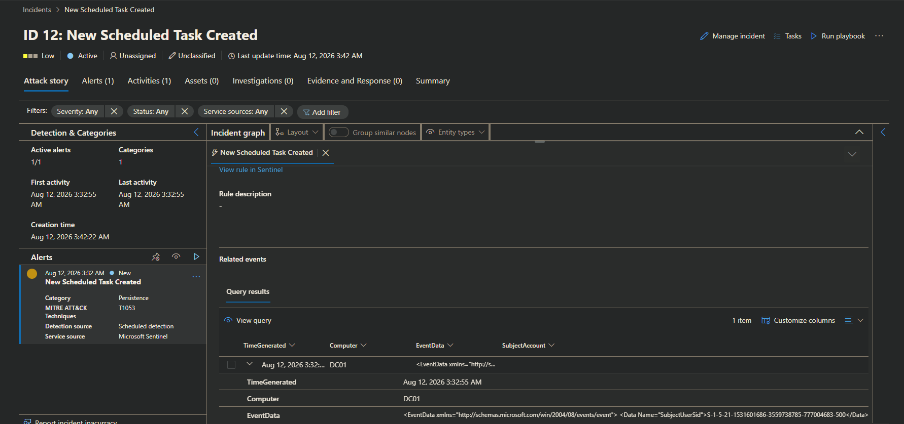
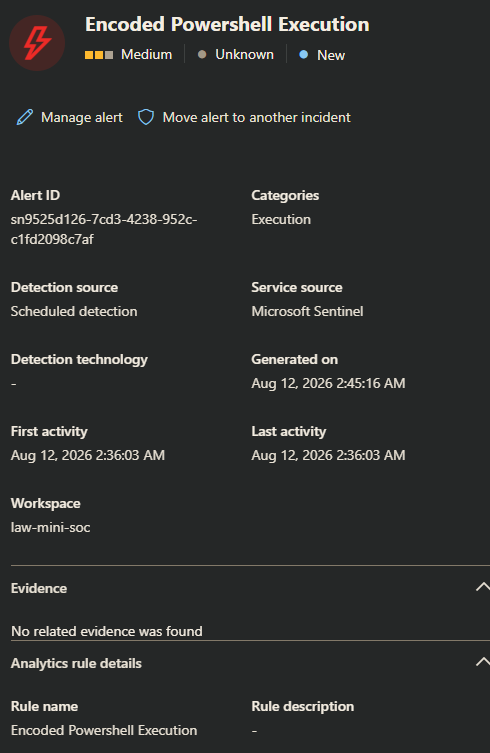
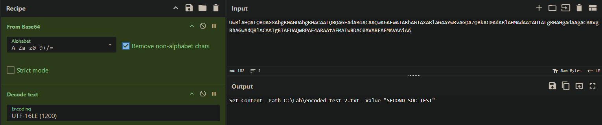
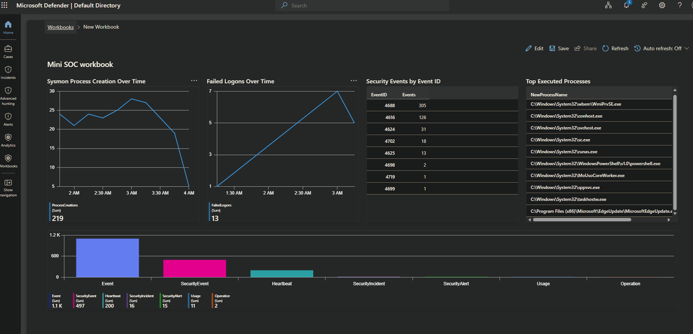

# Microsoft Sentinel Mini SOC Lab

## Overview

This project is a small SOC lab built to practice the full Tier 1 analyst workflow.

A Windows Server virtual machine named `DC01` is onboarded through Azure Arc and sends security telemetry to Log Analytics using Azure Monitor Agent, where it is analyzed in Microsoft Sentinel.

The lab focuses on collecting useful Windows, Sysmon and PowerShell events, writing KQL queries, creating analytics rules, generating incidents and investigating them.

The goal is not to reproduce a full enterprise SOC, but to demonstrate the main steps an entry-level SOC analyst may work with.

---

## Objectives

The main objectives of this lab were to:

- collect Windows security logs in Microsoft Sentinel;
- collect Sysmon and PowerShell telemetry;
- understand how Azure Monitor Agent and Data Collection Rules work;
- write KQL queries to investigate suspicious activity;
- create custom detection rules;
- generate Sentinel alerts and incidents;
- perform basic Tier 1 triage;
- correlate multiple data sources;
- classify alerts and determine whether the observed activity is malicious or benign;
- map detections to MITRE ATT&CK.

---

## Architecture

The lab uses one Windows Server 2022 virtual machine running in VirtualBox.

`DC01` is connected to Azure through Azure Arc.

Windows Security, Sysmon and PowerShell events are collected through Azure Monitor Agent and sent to the Log Analytics workspace `law-mini-soc`.

Microsoft Sentinel is used for hunting, detection and incident investigation.

## Technologies

- Microsoft Sentinel
- Azure Log Analytics
- Azure Arc
- Azure Monitor Agent
- Windows Server 2022
- VirtualBox
- Sysmon
- PowerShell Logging
- KQL
- MITRE ATT&CK

## Data Sources

The lab uses two main Sentinel tables.

### SecurityEvent

Windows Security events are collected through Windows Security Events via AMA.

Important events used in the lab include:

| Event ID | Description |
|---|---|
| 4624 | Successful logon |
| 4625 | Failed logon |
| 4688 | Process creation |
| 4698 | Scheduled task creation |
| 4702 | Scheduled task update |

### Event

Operational logs are collected through a custom Data Collection Rule.

The main sources are:

**Sysmon**

`Microsoft-Windows-Sysmon/Operational`

- Event ID 1 — Process creation

**PowerShell**

`Microsoft-Windows-PowerShell/Operational`

- Event ID 4104 — Script block logging

More details about the collection configuration are available in:

`configs/data-collection.md`

---

## Detection Engineering

Three detection scenarios were implemented.

### Detection 1 — Multiple Failed Logons

**Data source:** Windows Security Event 4625  
**MITRE ATT&CK:** T1110 — Brute Force

This detection looks for several failed authentication attempts against the same account within a short period of time.

The purpose is to identify behavior that may be related to password guessing or brute-force activity.

The investigation checks:

- target account;
- source of the attempts;
- number of failures;
- time interval;
- logon type;
- whether several accounts were targeted;
- whether a successful Event ID 4624 occurred afterwards.

---

### Detection 2 — Encoded PowerShell Execution

**Data sources:**

- Sysmon Event 1
- PowerShell Event 4104

**MITRE ATT&CK:** T1059.001 — PowerShell

This detection looks for PowerShell processes started with encoded command-line arguments such as:

`-EncodedCommand`

The activity is investigated using several telemetry sources.

Windows Event 4688 provides process creation information.

Sysmon Event 1 provides additional process execution details.

PowerShell Event 4104 provides visibility into the PowerShell script content.

This allows the same activity to be reviewed from several sources instead of relying on a single event.

---

### Detection 3 — Scheduled Task Creation

**Data source:** Windows Security Event 4698  
**MITRE ATT&CK:** T1053.005 — Scheduled Task/Job: Scheduled Task

This detection identifies the creation of a new Windows scheduled task.

The lab scenario created:

`SOC-Lab-Notepad`

The task launches:

`notepad.exe`

when a user logs on.

The activity is benign, but it demonstrates how scheduled tasks can be used as a persistence mechanism.

---

## Incident Investigation

Each detection was converted into a Sentinel analytics rule and tested with controlled activity.

The investigation process focused on answering simple SOC questions:

- What happened?
- Which host was involved?
- Which account was involved?
- When did it happen?
- What process or action was executed?
- Was the behavior expected?
- Was there any successful follow-up activity?
- Is escalation required?

The simulated incidents were classified as:

**True Positive — Benign Simulation**

The detections correctly identified the behavior they were designed to detect, but the activity was intentionally generated inside the lab.

This is an important distinction:

**A true positive does not automatically mean malicious activity.**

The detection can be correct while the investigation still concludes that the activity is benign.

### Encoded PowerShell Investigation

The analytics rule generated a Sentinel alert for the encoded PowerShell execution.

For the Encoded PowerShell incident, the command line contained a Base64-encoded payload.

The encoded value was extracted from the Windows process creation event and decoded using CyberChef with UTF-16LE encoding.

The decoded command revealed a benign test payload that created a local text file:

`Set-Content -Path C:\Lab\encoded-test-2.txt -Value "SECOND-SOC-TEST"`

This confirmed that the detection was valid while the underlying activity was part of the controlled lab simulation.

---

## SOC Workflow

The workflow used throughout the project was:

1. Generate controlled suspicious activity.
2. Validate the event locally on `DC01`.
3. Confirm that the telemetry reaches Microsoft Sentinel.
4. Hunt the activity manually with KQL.
5. Build and test detection logic.
6. Convert the query into an analytics rule.
7. Generate an alert and incident.
8. Perform initial triage.
9. Correlate Windows, Sysmon, and PowerShell telemetry when useful.
10. Decide whether the activity is a true or false positive.
11. Decide whether escalation is required.

This workflow is intentionally simple and focuses on the type of analysis expected from a SOC Tier 1 analyst.

---

## Dashboard

A Microsoft Sentinel Workbook was created to provide a quick overview of the lab.

The dashboard includes:

- failed logons over time;
- Sysmon process creation over time;
- top executed processes;
- Windows Security events by Event ID;
- general log ingestion visibility.

The purpose of the dashboard is not to replace investigation, but to provide a simple overview of activity in the monitored environment.

---

## MITRE ATT&CK Coverage

| Detection | Technique | MITRE ATT&CK ID |
|---|---|---|
| Multiple Failed Logons | Brute Force | T1110 |
| Encoded PowerShell Execution | PowerShell | T1059.001 |
| Scheduled Task Creation | Scheduled Task/Job: Scheduled Task | T1053.005 |

MITRE ATT&CK was used to give each detection a clear relationship with known attacker techniques.

---

## False Positives and Detection Tuning

The detections in this project are intentionally simple.

In a production environment, they would require additional tuning.

### Failed Logons

Possible legitimate causes include:

- users entering the wrong password;
- expired or recently changed passwords;
- applications using old credentials;
- service account configuration problems.

Possible improvements include:

- grouping attempts by account and source IP;
- considering the logon type;
- increasing severity when many accounts are targeted;
- checking whether a successful logon follows several failures.

### Encoded PowerShell

Encoded PowerShell is not always malicious.

Possible legitimate causes include:

- administrative scripts;
- deployment tools;
- automation;
- software management systems.

Possible improvements include:

- reviewing the parent process;
- correlating with Sysmon and PowerShell logs;
- excluding approved administrative tools;
- increasing severity when network, persistence, or credential-access activity is also present.

### Scheduled Tasks

Scheduled tasks are widely used by Windows and legitimate software.

Possible improvements include:

- excluding known task names;
- checking the executable path;
- reviewing command-line arguments;
- increasing severity for tasks running as SYSTEM;
- detecting execution from temporary or user-writable directories;
- correlating task creation with suspicious process activity.

---

## Lessons Learned

This project helped me understand how a small SOC monitoring pipeline works from the endpoint to the analyst.

The main lessons were:

- understanding how Windows telemetry is generated and collected;
- configuring and troubleshooting the data collection pipeline using Azure Arc, Azure Monitor Agent, Data Collection Rules and Log Analytics;
- understanding the difference between the `SecurityEvent` and `Event` tables;
- learning how Windows Security, Sysmon and PowerShell logs complement each other during an investigation;
- becoming more comfortable with the Azure Portal, Microsoft Sentinel and Log Analytics interfaces;
- using KQL for both hunting and detection engineering;
- validating events locally before troubleshooting ingestion problems;
- understanding how analytics rules turn KQL detections into alerts and incidents;
- performing basic incident triage and deciding whether escalation is required;
- understanding that a true positive does not necessarily mean malicious activity;
- learning why telemetry should be selected and filtered instead of collecting everything;
- understanding how detection tuning can reduce false positives and improve signal quality.

The most important outcome of the project was learning how the different parts of a SOC pipeline work together:

`Windows telemetry → AMA / DCR → Log Analytics → Sentinel → KQL → Analytics Rule → Alert → Incident → Investigation`
