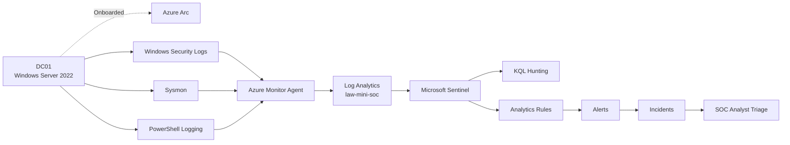

# Mini SOC Architecture

The lab is built around a single Windows Server 2022 virtual machine named `DC01`, running in VirtualBox.

`DC01` is onboarded into Azure using Azure Arc.

Windows Security, Sysmon, and PowerShell telemetry is collected by Azure Monitor Agent and sent to the Log Analytics workspace `law-mini-soc`.

Microsoft Sentinel uses this telemetry for hunting, analytics rules, alerts, incidents, and investigation.

## Data Flow

1. Activity occurs on `DC01`.
2. Windows Security, Sysmon, and PowerShell logs are generated locally.
3. Azure Monitor Agent collects the selected telemetry.
4. Data Collection Rules determine which operational events are forwarded.
5. The telemetry is sent to the Log Analytics workspace `law-mini-soc`.
6. Microsoft Sentinel uses the collected data for hunting and analytics rules.
7. Matching detections generate alerts and incidents for analyst triage.